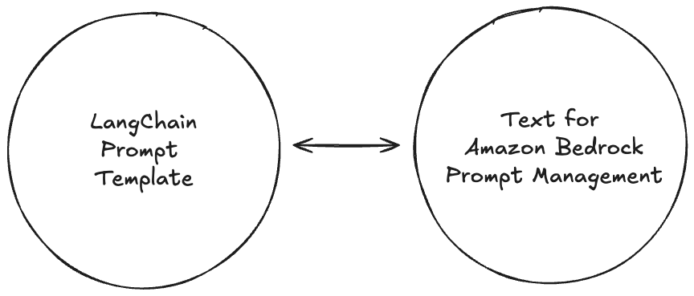

# Bedrock LangChain Prompt Converter

  
Bedrock LangChain Prompt Converter is a helper library that seamlessly integrates LangChain prompt templates with Amazon Bedrock's Prompt Management API, enabling efficient cross-platform prompt handling.  
  
NOTE: Currently *FewShotPromptTemplate* and *FewShotChatMessagePromptTemplate* are not supported.

## Usage

### 1. Creating a Chat Prompt Template

Create a ChatPromptTemplate using LangChain:

```python
from langchain_core.prompts import (
    ChatPromptTemplate,
    HumanMessagePromptTemplate,
    SystemMessagePromptTemplate,
)

chat_prompt = ChatPromptTemplate.from_messages(
    [
        SystemMessagePromptTemplate.from_template(
            "This system can answer astronomical questions."
        ),
        HumanMessagePromptTemplate.from_template("{user_input}"),
    ]
)
```

### 2. Initializing the Prompt Manager

Initialize the PromptManager with your AWS region:

```python
from src import PromptManager

prompt_manager = PromptManager(
    {
        "region_name": "us-west-2"
    }
)
```

### 3. Creating a Prompt

Use the prompt manager to create a new prompt in Amazon Bedrock:

```python
from src import ChatModelId

prompt_manager.create_prompt(
    chat_prompt,
    "astronomical_questions",
    model_id=ChatModelId.CLAUDE_V3_5_SONNET.value,
)
```

### 4. Creating a Prompt Version

Create a new version of the prompt:

```python
prompt_manager.create_prompt_version()
```

### 5. Retrieving a Prompt

Retrieve a specific version of a prompt:

```python
retrieved_prompt = prompt_manager.get_prompt(name="astronomical_questions", prompt_version=1)
```

### 6. Deleting a Prompt

Delete a prompt when it's no longer needed:

```python
prompt_manager.delete_prompt()
```

## Additional Resources
- [Construct and Store Reusable Prompts with Prompt Management in Amazon Bedrock](https://docs.aws.amazon.com/bedrock/latest/userguide/prompt-management.html)
- [AWS Samples](https://github.com/aws-samples/amazon-bedrock-samples/tree/main/articles-guides/prompt-engineering/Prompt_Management_Flows)
- [Streamline Generative AI Development in Amazon Bedrock with Prompt Management and Prompt Flows (Preview)](https://aws.amazon.com/ko/blogs/machine-learning/streamline-generative-ai-development-in-amazon-bedrock-with-prompt-management-and-prompt-flows-preview/)

## License

[MIT License](LICENSE)